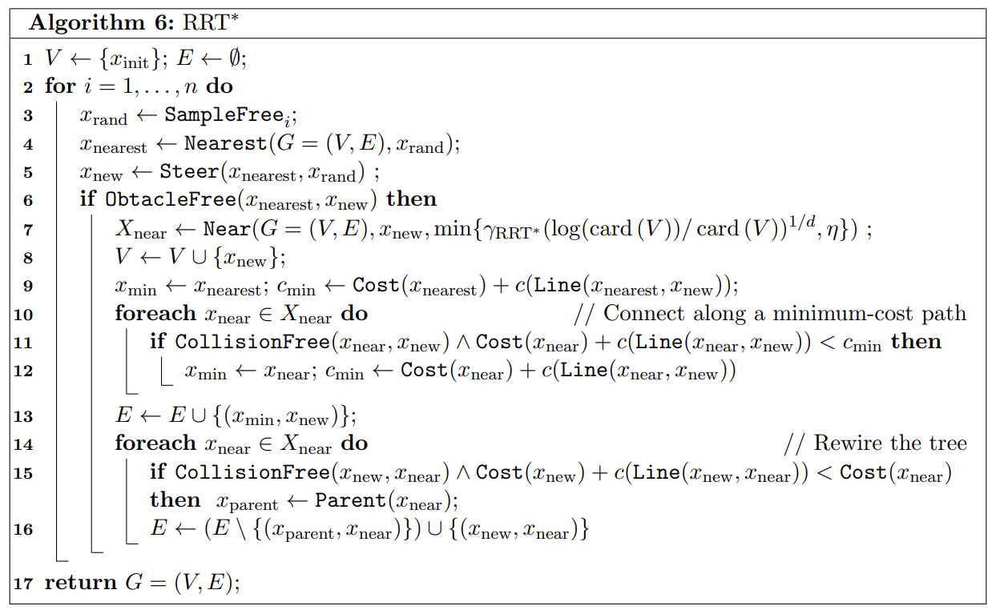

# Lab 6 — RRT* 기반 장애물 회피

이 과제는 lab5의 pure pursuit에서 한 걸음 더 나아가, **occupancy grid 위에서 RRT\* 알고리즘으로 실시간 경로를 찾고 장애물을 회피**하는 것이 목표다.

난이도가 lab2~5에 비해 상당히 높은 편이라, 단계를 둘로 나누어 진행한다.

| 단계 | 내용 | template 제공 여부 |
| --- | --- | --- |
| Stage 1 | RRT\* 자체 구현. occupancy grid 빌드 + 트리 확장 + collision check + rewire | TODO로 제공 |
| Stage 2 | 위에서 구현한 RRT\*를 pure pursuit과 통합. 장애물 상황에서 RRT\* path를 따르도록 모드 분기 | `follow_path` 만 TODO로 제공. 나머지 구조/로직은 자유롭게 설계 |


---

## 0. 시작하기 전에

### 빌드 & 실행

```bash
cd ~/f1tenth_ws
colcon build --packages-select lab6
source install/setup.bash
ros2 run lab6 rrt_node
```

### RViz 설정

본 template에는 [gym_bridge.rviz](gym_bridge.rviz) 파일이 함께 제공된다. 이 파일에는 lab4~6에서 사용하는 주요 topic들이 모두 사전 등록되어 있어, 학생이 매번 add 버튼을 눌러 토픽을 추가할 필요가 없다.


```bash
# at ../f1tenth_labs/lab6
rviz2 -d gym_bridge.rviz
```


### `ENABLE_DRIVE` 플래그

[`lab6/rrt_node.py`](lab6/rrt_node.py) 최상단에 다음 플래그가 있다.

```python
ENABLE_DRIVE = True
```

- **`True`** (초기값): pure pursuit baseline이 waypoint를 따라 차량을 주행시킨다.
  - Stage 1까지만 구현된 상태에서는 RRT\*는 시각화만 되고 실제 주행에는 사용되지 않는다. 따라서 **장애물에 부딪힐 수 있다**.
  - Stage 2의 `follow_path`까지 완성하면, 장애물 상황에서 RRT\* 경로를 따르며 회피하게 된다.
- **`False`**: 차량은 정지 상태(`speed = 0`)로 유지되고, RRT\* 트리와 occupancy grid만 RViz로 시각화된다.
  - **Stage 1을 검증할 때는 이 모드를 권장**한다. 차가 안 움직이니 충돌 걱정 없이 RRT\*가 잘 동작하는지 확인할 수 있다.

---

## 1. Stage 1 — RRT\* 구현

### 1.1 Occupancy Grid 빌드 (`scan_callback`)

RRT\*가 collision check를 하려면, 매 LaserScan 마다 차량 주변을 occupancy grid로 변환해 두어야 한다. 셀 크기, grid 영역, inflation 두께 등 관련 파라미터는 `RRTStar.__init__`에 기본값으로 미리 설정되어 있으니 그대로 사용해도 되고 필요하면 조정해도 된다.

#### 좌표 변환 helper

좌표 변환 함수 세 가지는 이미 제공되어 있다. 직접 구현할 필요 없다.

| 함수 | 입력 | 출력 |
| --- | --- | --- |
| `local_to_global(x, y)` | 차량 frame (x, y) | map frame (x, y) |
| `global_to_local(x, y)` | map frame (x, y) | 차량 frame (x, y) |
| `convert_to_grid(x, y)` | 현재 차량 frame (x, y) | grid 셀 인덱스 (gx, gy) |

### 1.2 RRT\* 메인 알고리즘 (`perform_rrt_star`)

다음 pseudocode를 그대로 따라 구현한다. 



각 line이 코드에서 어떻게 대응되는지 정리하면:

| Pseudocode | 코드 | 비고 |
| --- | --- | --- |
| L1: `V ← {x_init}; E ← {}` | `self.nodes = [RRTStarNode(0, 0)]` | `pose_callback`에서 매 cycle reset됨 |
| L3: `x_rand ← SampleFree` | `get_random_node()` | grid 영역 내 uniform 샘플 |
| L4: `x_nearest ← Nearest(G, x_rand)` | `get_nearest_node(x_rand)` | min distance |
| L5: `x_new ← Steer(x_nearest, x_rand)` | step_size만큼 `x_rand` 방향으로 전진 | inline |
| L6: `ObstacleFree(x_nearest, x_new)` | `is_collision_free(...)` | grid 셀 단위 sampling |
| L7: `X_near ← Near(G, x_new, ...)` | `get_neighbors(x_new)` | `neighborhood_radius` 이내 |
| L8: `V ← V ∪ {x_new}` | `self.nodes.append(x_new)` | |
| L9–12: 최소 cost parent 선택 | inline for-loop | |
| L13: `E ← E ∪ {(x_min, x_new)}` | `new_node.parent = best_parent` | |
| L14–16: rewire | `rewire(new_node, neighbors)` | |
| L17: `return G = (V, E)` | implicit (`self.nodes`) | |


---

## 2. Stage 2 — Pure Pursuit과의 통합

본 단계는 Stage 1과 달리 정답이 하나로 정해져 있지 않다. 따라서 helper 함수를 template에 따로 두지 않았고, 모드 분기의 진입점인 **`follow_path`** 만 TODO로 남겨두었다. 아래 항목들은 설계 시 고려할 만한 컨셉만 제시하니, 구체적인 자료구조 / 함수 이름 / 임계값 등은 학생이 자유롭게 정해 구현하면 된다.

#### (a) 모드 결정 — RRT\*를 언제 쓸 것인가

전방 waypoint 경로가 occupancy grid에서 막혀 있는지 매 cycle 판정. 막혀 있으면 RRT\* path를 따르고, 뚫려 있으면 pure pursuit(이하 PP)으로 정상 주행. Stage 2의 진입점 자체이므로 가장 먼저 구현해야 한다.

#### (b) Hysteresis — flickering 방지

판정이 한 프레임 단위로 들쭉날쭉하면 PP/RRT\* 사이를 빠르게 오가며 핸들이 흔들린다. *막힘 → 즉시 RRT\* 진입*, *뚫림 → 일정 프레임 이상 연속 확인 후 PP 복귀* 와 같은 비대칭 hysteresis가 안정적이다.

#### (c) `rrt_goal` 선택 개선

template의 `_find_rrt_goal_global`은 단순히 전방 거리만 보고 waypoint를 고른다. occupancy grid에서 점유된 셀 위에 있는 waypoint를 후보에서 거르면, RRT\*가 도달 불가능한 점을 goal로 잡고 매 cycle 실패하는 상황을 피할 수 있다.

#### (d) RRT\* path에서 steering target 뽑기

RRT\* 모드에서 차량을 실제로 움직이려면 path를 steering 명령으로 변환해야 한다. RRT\* path는 `step_size = 0.3 m`로 촘촘해서 path의 첫 node를 그대로 target으로 쓰면 lookahead가 너무 짧아 핸들이 민감해진다. pure pursuit과 동일한 lookahead 거리에 있는 path 위 점을 target으로 쓰는 편이 자연스럽다 (`_lookahead_on_polyline` helper가 이미 제공됨).

#### (e) Fallback

RRT\*가 한 cycle 안에 path를 찾지 못할 수 있다. 직전 cycle target 재활용, 정지 명령 등 안전한 fallback 동작을 정의해 두자.

여기까지가 Stage 2 기본 동작에 필요한 항목이다. 아래는 안정성·성능을 더 끌어올리고 싶을 때 시도해볼 수 있는 선택적 개선이다.

#### (f) Warm-start — 직전 cycle path 재활용

매 cycle 빈 트리에서 시작하면 운이 나쁠 때 `max_iterations` 안에 goal에 도달하지 못한다. 직전 cycle에서 찾은 path를 다음 cycle의 트리 seed로 미리 심어두면 path 발견 안정성이 크게 올라간다.

#### (g) Biased sampling

uniform random sampling은 의외로 비효율적이다. 일정 확률로 `rrt_goal` 또는 전방 waypoint를 샘플로 잡으면 트리가 진행 방향으로 빠르게 자란다.

#### (h) 모드별 속도 차등

PP 모드에서는 빠르게, RRT\* 모드(회피 중)에서는 보수적으로 차등하면 안전성과 평균 속도를 모두 챙길 수 있다.


